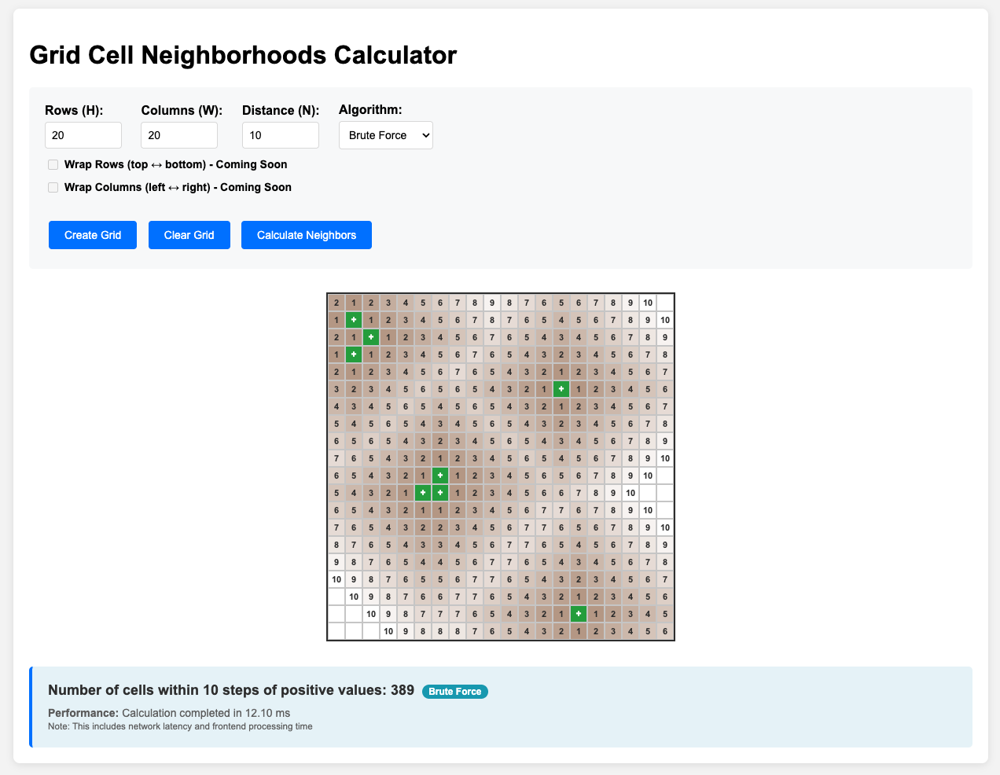

# How To Run

#### Assumptions
- Python already installed, version 3.10 or higher (system-installed Python is okay to use)

## Installation
### Without Rye (using pre-installed Pip)
1. Clone repository locally
2. From project root directory, create a virtual python environment
> python -m venv .venv
3. Activate venv
> source .venv/bin/activate
4. Update Pip
> pip install --upgrade pip
5. Install production and development dependencies
> pip install -r requirements.lock; pip install -r requirements-dev.lock

### Using Rye
1. Install Rye, if necessary
> curl -sSf https://rye.astral.sh/get | bash
2. From project directory, install venv and dependencies
> rye sync
3. Activate venv
> source .venv/bin/activate

## Execution

### Combined Client / Server
> rye run app

### Separate Client / Server

#### Start Server
1. From project root directory, start Flask application manually
> python app.py &

or with Rye
> rye run server

Expected logs when it starts correctly:
```Starting Grid Cell Neighborhoods API...
Open http://localhost:8000/health to check if the server is running
Frontend should be accessible by opening index.html in a web browser
 * Serving Flask app 'app'
 * Debug mode: on
WARNING: This is a development server. Do not use it in a production deployment. Use a production WSGI server instead.
 * Running on all addresses (0.0.0.0)
 * Running on http://127.0.0.1:8000
 * Running on http://192.168.1.109:8000
Press CTRL+C to quit
 * Restarting with stat
Starting Grid Cell Neighborhoods API...
Open http://localhost:8000/health to check if the server is running
Frontend should be accessible by opening index.html in a web browser
 * Debugger is active!
 * Debugger PIN: 675-916-784
127.0.0.1 - - [26/Aug/2025 12:54:43] "OPTIONS /calculate HTTP/1.1" 200 -
127.0.0.1 - - [26/Aug/2025 12:54:43] "POST /calculate HTTP/1.1" 200 -
```

#### Run Client
1.  Open `index.html` in a browser

or with Rye
> rye run client

### Usage
Input values are bound by the task description
1. **Set Grid Dimensions**: Enter the number of rows H and columns W 
2. **Set Distance Threshold**: Enter the Manhattan distance threshold N (0-20)
3. **Create Grid**: Click "Create Grid" to generate an empty grid
4. **Select Positive Cells**: Click on cells to mark them as positive (they will turn green)
5. **Calculate**: Click "Calculate Neighbors" to find all cells within N steps of positive cells
6. **Output**:
<br>- Grid will colorize the cells based on their distance from the nearest positive cell and display the number of steps within the cell.
<br>- Below the grid an info box will show the total number of neighbors (including positive cells) and the time it took for the entire operation.

### *Notes*
- Only algorithm available is "Brute Force," but "BFS" and "Dijkstra" will be added.
- Flags for allowing row and col indices to be wrapped are disabled, but will be added. 